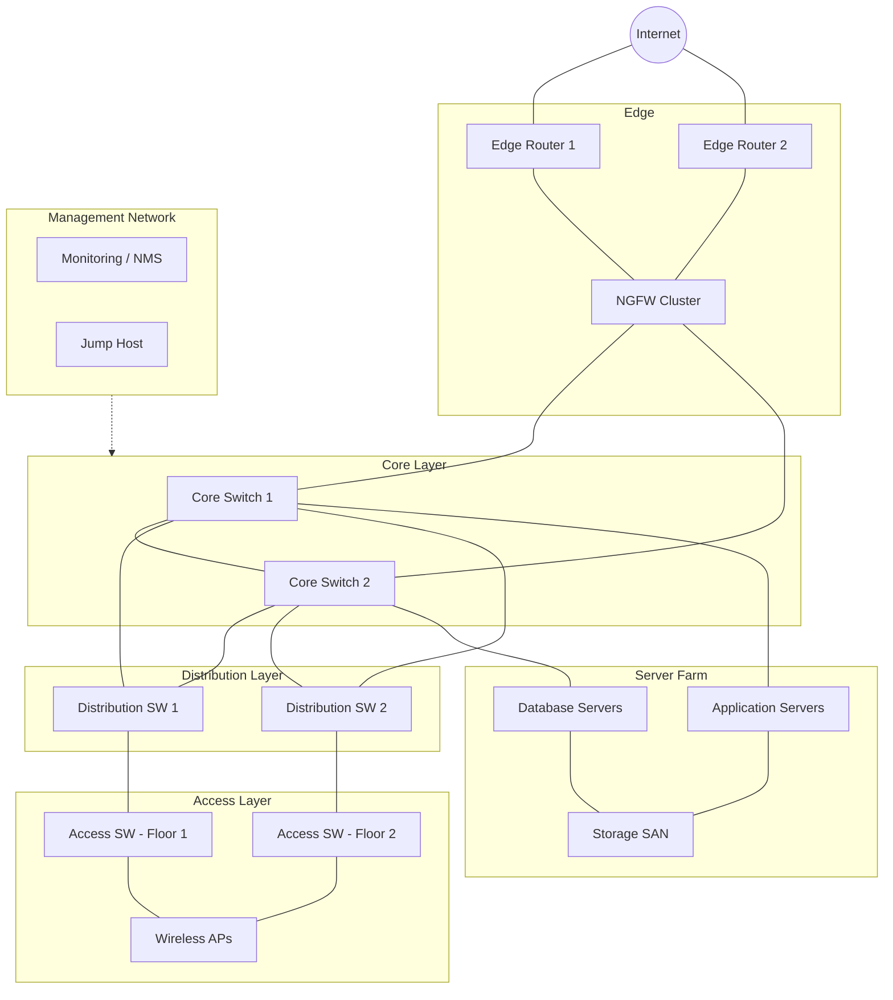

# 🌐 Enterprise Network Architecture

Το κλασικό **three-tier (hierarchical) μοντέλο** χωρίζει το εταιρικό δίκτυο σε **Core**, **Distribution** και **Access**, ώστε να είναι κλιμακούμενο, ανθεκτικό και εύκολο στη διαχείριση.

## 📐 Διάγραμμα

## 🧱 Επίπεδα και ρόλοι

| Επίπεδο | Ρόλος | Τυπικός εξοπλισμός |
|---------|-------|--------------------|
| **Edge** | Σύνδεση με Internet/ISP, ασφάλεια περιμέτρου | Routers, NGFW |
| **Core** | Γρήγορη μεταγωγή (switching) μεταξύ περιοχών, χωρίς πολιτικές | Layer 3 switches υψηλής χωρητικότητας |
| **Distribution** | Inter-VLAN routing, πολιτικές, ACLs, QoS, συγκέντρωση uplinks | Layer 3 switches |
| **Access** | Σύνδεση τελικών συσκευών, PoE, port security | Layer 2 switches, APs |
| **Server Farm** | Εφαρμογές, βάσεις, αποθήκευση | Servers, SAN/NAS |
| **Management** | Out-of-band διαχείριση και monitoring | Jump host, NMS |

## ✅ Βέλτιστες πρακτικές

- **Redundancy παντού:** διπλοί routers, firewalls (HA pair), core switches και uplinks.
- Χρήση **Link Aggregation (LACP)** και **STP/RSTP** ή καλύτερα Layer 3 έως το access (routed access) για αποφυγή loops.
- **Segmentation:** ξεχωριστά VLANs για χρήστες, servers, VoIP, guests και management.
- Το Core κρατιέται **απλό και γρήγορο**: χωρίς ACLs ή βαριά επεξεργασία.
- Ξεχωριστό **Management network** (out-of-band αν είναι δυνατόν).
- Τεκμηρίωση: IP plan, VLAN plan, φυσικό και λογικό διάγραμμα.

## ⚠️ Συχνά λάθη

- Ένα μόνο firewall ή core switch (single point of failure).
- Flat network χωρίς VLANs (μεγάλο broadcast domain, κακή ασφάλεια).
- Έλλειψη monitoring στα uplinks, οπότε τα προβλήματα εντοπίζονται αργά.
- Μη ελεγχόμενα default credentials σε switches και APs.

## 🔗 Σχετικά

[VLAN / Routing](./05-vlan-routing-topology.md) · [DMZ](./04-dmz-architecture.md) · [Monitoring](./07-monitoring-architecture.md)
