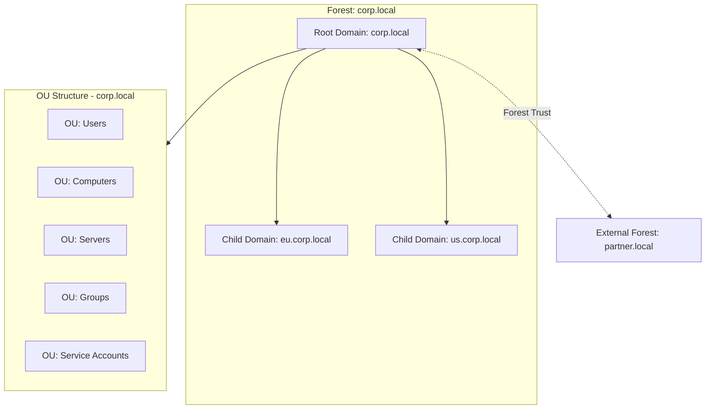
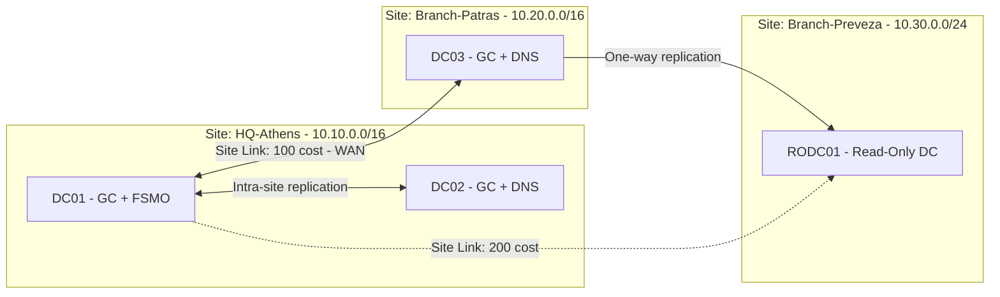

# 🏢 Active Directory Topology

Η τοπολογία του AD περιγράφεται σε δύο επίπεδα:

- **Λογική δομή:** Forest, Domains, Organizational Units (OUs), Trusts.
- **Φυσική δομή:** Sites, Subnets, Domain Controllers, Replication.

## 📐 Λογική δομή (Forest / Domain)

## 📐 Φυσική δομή (Sites και Replication)

## 🧱 Βασικά συστατικά

| Συστατικό | Περιγραφή |
|-----------|-----------|
| **Forest** | Όριο ασφαλείας και κοινό Schema / Global Catalog |
| **Domain** | Όριο διαχείρισης, πολιτικών και replication ονομάτων |
| **OU** | Λογική οργάνωση αντικειμένων και delegation / GPO |
| **Site** | Φυσική τοποθεσία με γρήγορο δίκτυο (ορίζεται από subnets) |
| **Site Link** | Ορίζει κόστος και προγραμματισμό replication μεταξύ sites |
| **Global Catalog (GC)** | Μερικό αντίγραφο όλων των αντικειμένων του forest |
| **RODC** | Read-only DC για ανασφαλή ή απομακρυσμένα sites |

## 👑 Ρόλοι FSMO (5)

| Ρόλος | Εύρος | Λειτουργία |
|-------|-------|-----------|
| Schema Master | Forest | Αλλαγές στο Schema |
| Domain Naming Master | Forest | Προσθήκη / αφαίρεση domains |
| PDC Emulator | Domain | Συγχρονισμός ώρας, κωδικοί, GPO |
| RID Master | Domain | Κατανομή RID pools |
| Infrastructure Master | Domain | Αναφορές cross-domain |

## ✅ Βέλτιστες πρακτικές

- Τουλάχιστον **2 DCs ανά domain** και ανά κρίσιμο site.
- Ένα **single-domain forest** επαρκεί για τις περισσότερες εταιρείες. Τα πολλαπλά domains αυξάνουν την πολυπλοκότητα.
- Ορθή ρύθμιση **Sites & Subnets** ώστε οι clients να βρίσκουν το κοντινότερο DC.
- **DNS** ενσωματωμένο στο AD σε κάθε DC.
- Τακτικό **System State backup** των DCs και δοκιμή επαναφοράς.
- **Tiered administration model** (Tier 0/1/2) για προστασία των privileged accounts.
- Αρχικό έλεγχο υγείας: `dcdiag /v`, `repadmin /replsummary`, `repadmin /showrepl`.

## ⚠️ Συχνά λάθη

- Όλοι οι FSMO ρόλοι σε DC που δεν έχει backup.
- Λανθασμένος χρόνος (Kerberos αποτυγχάνει με απόκλιση > 5 λεπτά).
- Έλλειψη Subnets στο Sites & Services, οπότε οι clients κάνουν authentication μέσω WAN.
- Χρήση Domain Admin για καθημερινές εργασίες.

## 🔗 Σχετικά

[Hybrid Cloud (Entra Connect)](./03-hybrid-cloud.md) · [Backup](./06-backup-architecture.md)
