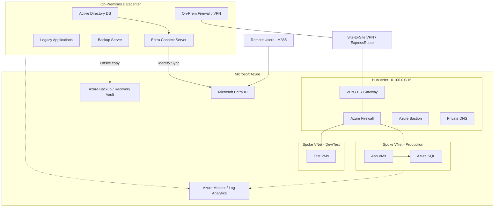

# ☁️ Hybrid Cloud Architecture

Η **υβριδική αρχιτεκτονική** συνδυάζει την τοπική υποδομή (on-premises) με δημόσιο cloud (π.χ. Microsoft Azure), με κοινή ταυτότητα, ασφαλή σύνδεση και κεντρική διαχείριση.

## 📐 Διάγραμμα (Hub-and-Spoke με Azure)

## 🧱 Βασικά συστατικά

| Συστατικό | Ρόλος |
|-----------|-------|
| **Entra Connect** | Συγχρονισμός χρηστών/ομάδων από AD προς Entra ID |
| **Entra ID** | Cloud identity provider: SSO, MFA, Conditional Access |
| **VPN Gateway / ExpressRoute** | Ασφαλής σύνδεση on-prem ↔ cloud (ExpressRoute = ιδιωτικό κύκλωμα) |
| **Hub VNet** | Κεντρικές υπηρεσίες: firewall, gateway, DNS, bastion |
| **Spoke VNets** | Απομονωμένα περιβάλλοντα (prod, dev) συνδεδεμένα με το hub |
| **Azure Monitor** | Ενιαίο monitoring για cloud και on-prem |
| **Recovery Services Vault** | Cloud backup και DR (Azure Site Recovery) |

## 🔐 Μοντέλα ταυτότητας (Entra Connect)

| Μέθοδος | Περιγραφή | Πότε |
|---------|-----------|------|
| **Password Hash Sync (PHS)** | Συγχρονισμός hash του κωδικού | Απλότητα, ανθεκτικότητα (συνιστάται) |
| **Pass-through Authentication (PTA)** | Έλεγχος κωδικού στο on-prem AD | Όταν δεν επιτρέπεται sync hash |
| **Federation (AD FS)** | Εξωτερικός IdP | Σύνθετες απαιτήσεις (όλο και λιγότερο συνηθισμένο) |

## ✅ Βέλτιστες πρακτικές

- Σχεδιασμός **μη επικαλυπτόμενων IP ranges** μεταξύ on-prem και cloud πριν από οποιαδήποτε σύνδεση.
- **Hub-and-spoke** για κεντρικό έλεγχο κίνησης και firewall.
- **MFA και Conditional Access** για όλους τους χρήστες, ειδικά τους admins.
- Ξεχωριστοί **λογαριασμοί διαχειριστών cloud** (cloud-only, όχι συγχρονισμένοι από AD).
- Κεντρικό **logging και monitoring** και για τα δύο περιβάλλοντα.
- **Tagging** πόρων και Azure Policy για governance και κόστος.
- Δοκιμές **failover της σύνδεσης** (π.χ. δεύτερο VPN tunnel).

## ⚠️ Συχνά λάθη

- Επικαλυπτόμενα subnets (αδύνατη δρομολόγηση).
- Ένα μόνο VPN tunnel χωρίς redundancy.
- Έλλειψη ελέγχου κόστους, με VMs που τρέχουν χωρίς λόγο.
- Συγχρονισμός privileged AD accounts στο cloud.

## 🔗 Σχετικά

[Active Directory](./02-active-directory-topology.md) · [Disaster Recovery](./08-disaster-recovery-architecture.md) · [Monitoring](./07-monitoring-architecture.md)
