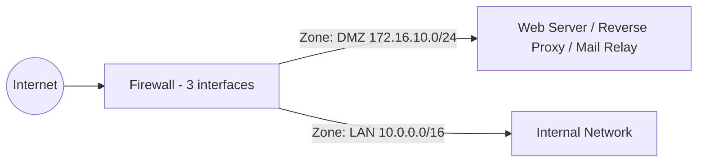
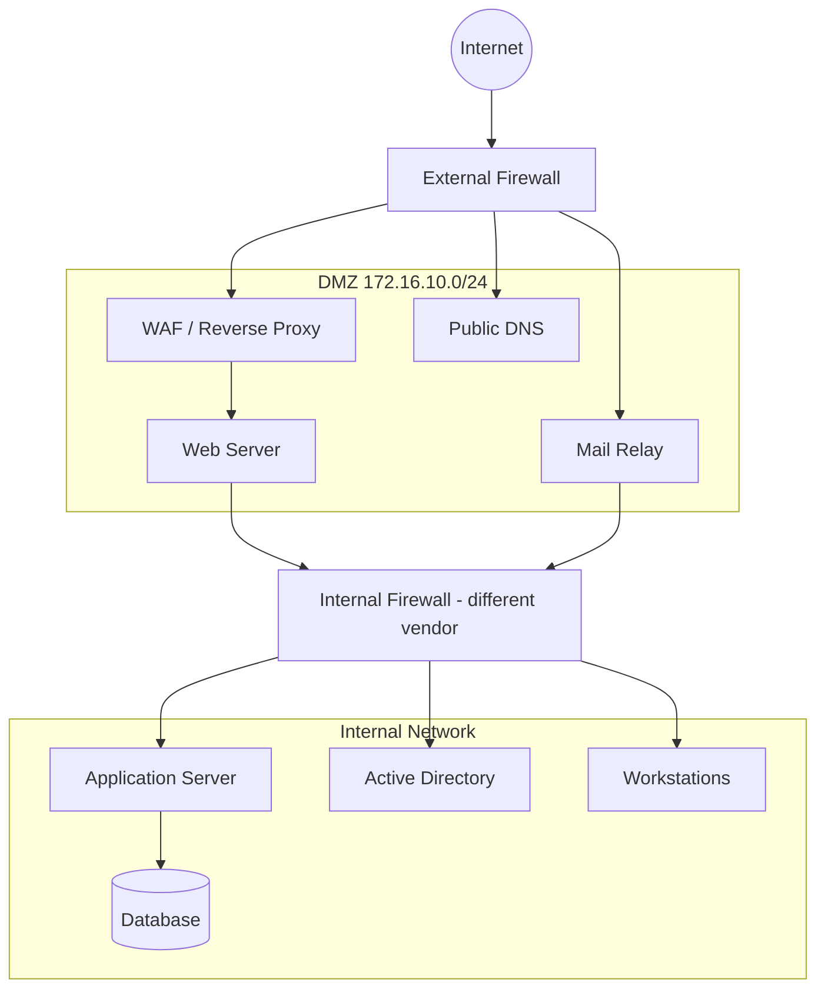

# 🛡️ DMZ Architecture

Η **DMZ (Demilitarized Zone)** είναι ένα ενδιάμεσο δίκτυο ανάμεσα στο Internet και το εσωτερικό δίκτυο. Φιλοξενεί υπηρεσίες που πρέπει να είναι προσβάσιμες απ' έξω (web, mail, reverse proxy), χωρίς να εκθέτει άμεσα το εσωτερικό LAN.

## 📐 Διάγραμμα 1: Single Firewall (3-legged)

## 📐 Διάγραμμα 2: Dual Firewall (πιο ασφαλής)

## 🧾 Παράδειγμα πολιτικής κυκλοφορίας (Firewall Rules)

| Από | Προς | Θύρα | Ενέργεια | Σχόλιο |
|-----|------|------|----------|--------|
| Internet | DMZ Web | 443/TCP | ✅ Allow | Μόνο HTTPS |
| Internet | DMZ Mail | 25/TCP | ✅ Allow | SMTP εισερχόμενα |
| Internet | LAN | Any | ❌ Deny | Καμία άμεση πρόσβαση |
| DMZ Web | LAN App Server | 8443/TCP | ✅ Allow | Μόνο συγκεκριμένη θύρα |
| DMZ | LAN (υπόλοιπα) | Any | ❌ Deny | Μια παραβιασμένη DMZ δεν φτάνει στο LAN |
| LAN | DMZ | 22, 3389 | ✅ Allow | Διαχείριση (μέσω jump host) |
| LAN | Internet | 80, 443 | ✅ Allow | Μέσω proxy |
| DMZ | Internet | 80, 443 | ⚠️ Περιορισμένο | Μόνο για updates / whitelist |

## ✅ Βέλτιστες πρακτικές

- **Default Deny** σε όλες τις κατευθύνσεις και άνοιγμα μόνο του απαραίτητου.
- Κανένας server της DMZ **δεν είναι μέλος του κύριου AD domain** (ή χρησιμοποιεί ξεχωριστό domain / forest).
- **Reverse proxy και WAF** μπροστά από τις web εφαρμογές.
- Ενεργοποίηση **IDS/IPS** στη διαδρομή Internet → DMZ.
- Διαχείριση της DMZ μόνο από **jump host / bastion** με MFA.
- Αυστηρό **patching** και hardening των DMZ servers (ελάχιστες υπηρεσίες).
- Κεντρικό **logging** (syslog / SIEM) από όλα τα DMZ συστήματα.
- Σε dual-firewall σχεδίαση, χρήση **διαφορετικού vendor** για μείωση κοινής ευπάθειας.

## ⚠️ Συχνά λάθη

- Η DMZ έχει πλήρη πρόσβαση στο LAN ("any-any").
- Database server μέσα στη DMZ (πρέπει να μένει στο εσωτερικό δίκτυο).
- Κοινοί κωδικοί και λογαριασμοί μεταξύ DMZ και LAN.
- Έλλειψη ενημερώσεων σε "ξεχασμένους" DMZ servers.

## 🔗 Σχετικά

[Enterprise Network](./01-enterprise-network.md) · [VLAN / Routing](./05-vlan-routing-topology.md) · [Monitoring](./07-monitoring-architecture.md)
