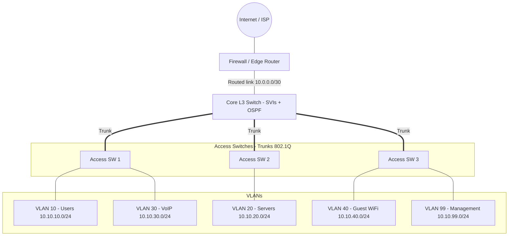
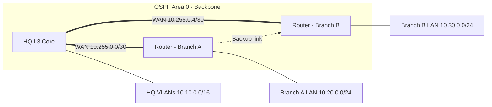

# 🔀 VLAN & Routing Topology

Τα **VLANs** χωρίζουν ένα φυσικό δίκτυο σε πολλά λογικά (broadcast domains). Για να επικοινωνήσουν μεταξύ τους χρειάζεται **inter-VLAN routing** σε Layer 3 συσκευή.

## 📐 Διάγραμμα (Layer 3 Switch + Inter-VLAN Routing)



## 📐 Διάγραμμα δρομολόγησης (Multi-site με OSPF)



## 🗂️ Πλάνο VLAN (παράδειγμα)

| VLAN ID | Όνομα | Subnet | Gateway | Σκοπός |
|---------|-------|--------|---------|--------|
| 10 | USERS | 10.10.10.0/24 | 10.10.10.1 | Υπολογιστές χρηστών |
| 20 | SERVERS | 10.10.20.0/24 | 10.10.20.1 | Εσωτερικοί servers |
| 30 | VOIP | 10.10.30.0/24 | 10.10.30.1 | IP τηλέφωνα (QoS) |
| 40 | GUEST | 10.10.40.0/24 | 10.10.40.1 | Επισκέπτες (μόνο Internet) |
| 99 | MGMT | 10.10.99.0/24 | 10.10.99.1 | Διαχείριση συσκευών |
| 999 | BLACKHOLE | - | - | Αχρησιμοποίητες θύρες (shutdown) |

## 💻 Παράδειγμα διαμόρφωσης (Cisco IOS)

```text
! --- Δημιουργία VLANs ---
vlan 10
 name USERS
vlan 20
 name SERVERS

! --- Inter-VLAN routing (SVIs) στο L3 switch ---
ip routing
interface vlan 10
 ip address 10.10.10.1 255.255.255.0
 no shutdown
interface vlan 20
 ip address 10.10.20.1 255.255.255.0
 no shutdown

! --- Trunk προς access switch ---
interface gigabitEthernet 1/0/48
 switchport trunk encapsulation dot1q
 switchport mode trunk
 switchport trunk allowed vlan 10,20,30,99
 switchport trunk native vlan 999

! --- Θύρα χρήστη ---
interface gigabitEthernet 1/0/1
 switchport mode access
 switchport access vlan 10
 spanning-tree portfast
 switchport port-security

! --- OSPF ---
router ospf 1
 router-id 1.1.1.1
 network 10.10.0.0 0.0.255.255 area 0
 passive-interface default
 no passive-interface gigabitEthernet 1/0/47
```

## 🔎 Μέθοδοι Inter-VLAN Routing

| Μέθοδος | Περιγραφή | Χρήση |
|---------|-----------|-------|
| **Router-on-a-stick** | Ένας router με subinterfaces πάνω σε ένα trunk | Μικρά δίκτυα, labs |
| **Layer 3 Switch (SVI)** | Routing στο switch με virtual interfaces | Τυπική επιλογή σε εταιρικά δίκτυα |
| **Routed ports** | Layer 3 θύρες, χωρίς VLANs | Core / uplinks |

## ✅ Βέλτιστες πρακτικές

- Native VLAN **διαφορετικό από το 1** και αχρησιμοποίητο.
- **Allowed VLAN list** στα trunks (όχι "all").
- Αχρησιμοποίητες θύρες: `shutdown` και τοποθέτηση σε blackhole VLAN.
- Ενεργοποίηση **BPDU Guard / Root Guard**, **DHCP Snooping** και **Dynamic ARP Inspection**.
- **ACLs** στο inter-VLAN routing (π.χ. οι guests δεν φτάνουν στους servers).
- **Passive-interface** στα LAN interfaces όπου δεν χρειάζεται OSPF.
- Συνεπής σύμβαση: το VLAN ID να αντιστοιχεί στο τρίτο octet (VLAN 10 → 10.10.**10**.0/24).

## ⚠️ Συχνά λάθη

- VLAN που δεν υπάρχει σε όλα τα switches του trunk path.
- Αναντιστοιχία native VLAN μεταξύ των δύο άκρων του trunk.
- Ξεχασμένα default gateway ή DHCP helper (`ip helper-address`).
- Επικαλυπτόμενα subnets μεταξύ sites.

## 🛠️ Εντολές ελέγχου

```text
show vlan brief
show interfaces trunk
show ip interface brief
show ip route
show ip ospf neighbor
show spanning-tree
```

## 🔗 Σχετικά

[Enterprise Network](./01-enterprise-network.md) · [DMZ](./04-dmz-architecture.md)
