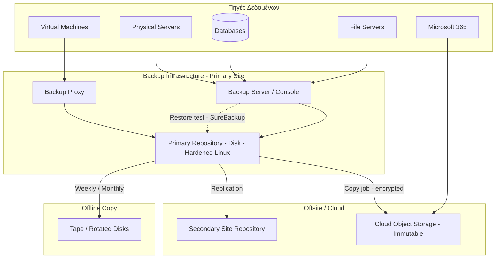

# 💾 Backup Architecture

Μια σωστή αρχιτεκτονική backup βασίζεται στον κανόνα **3-2-1-1-0**:

| Αριθμός | Σημασία |
|---------|---------|
| **3** | Τουλάχιστον 3 αντίγραφα των δεδομένων (παραγωγή + 2 backups) |
| **2** | Σε 2 διαφορετικούς τύπους αποθήκευσης |
| **1** | 1 αντίγραφο εκτός τοποθεσίας (offsite) |
| **1** | 1 αντίγραφο **offline ή immutable** (προστασία από ransomware) |
| **0** | 0 σφάλματα μετά από δοκιμή επαναφοράς (restore test) |

## 📐 Διάγραμμα

## 🔄 Τύποι Backup

| Τύπος | Περιγραφή | Χώρος | Ταχύτητα backup | Ταχύτητα restore |
|-------|-----------|-------|-----------------|------------------|
| **Full** | Πλήρες αντίγραφο | Μεγάλος | Αργή | Γρήγορη |
| **Incremental** | Μόνο αλλαγές από το τελευταίο backup | Μικρός | Γρήγορη | Αργή (αλυσίδα) |
| **Differential** | Αλλαγές από το τελευταίο Full | Μεσαίος | Μεσαία | Μεσαία |
| **Synthetic Full** | Full που συντίθεται από incrementals | Μεγάλος | Γρήγορη | Γρήγορη |

## 📅 Παράδειγμα πολιτικής διατήρησης (GFS)

| Επίπεδο | Συχνότητα | Διατήρηση |
|---------|-----------|-----------|
| Daily (Son) | Κάθε μέρα | 14 ημέρες |
| Weekly (Father) | Κάθε Κυριακή | 8 εβδομάδες |
| Monthly (Grandfather) | Τέλος μήνα | 12 μήνες |
| Yearly | Τέλος έτους | 5-7 χρόνια (ανάλογα με συμμόρφωση) |

## ✅ Βέλτιστες πρακτικές

- Το backup server **δεν είναι μέλος του production AD domain** (ή χρησιμοποιεί ξεχωριστά credentials), ώστε να προστατεύεται από ransomware.
- **Immutable storage** (Object Lock / hardened repository) με μη διαγράψιμα αντίγραφα για συγκεκριμένο διάστημα.
- **Κρυπτογράφηση** των backups (in transit και at rest) και ασφαλής φύλαξη των κλειδιών.
- **Τακτικά restore tests** (τουλάχιστον τριμηνιαία): ένα backup που δεν έχει δοκιμαστεί δεν θεωρείται backup.
- **Application-aware backups** για AD, SQL, Exchange (VSS).
- Ειδοποιήσεις σε αποτυχία jobs και αναφορές επιτυχίας.
- Τεκμηρίωση διαδικασιών επαναφοράς (runbooks).
- Προστασία **Microsoft 365 / SaaS**: η Microsoft δεν αναλαμβάνει πλήρη backup των δεδομένων σας.

## ⚠️ Συχνά λάθη

- Όλα τα αντίγραφα στον ίδιο χώρο ή στο ίδιο storage με την παραγωγή.
- Backup server στο domain με πρόσβαση από Domain Admin accounts.
- Καμία δοκιμή επαναφοράς.
- Αγνόηση των system state / bare-metal backups για DCs.

## 🔗 Σχετικά

[Disaster Recovery](./08-disaster-recovery-architecture.md) · [Active Directory](./02-active-directory-topology.md) · [Monitoring](./07-monitoring-architecture.md)
