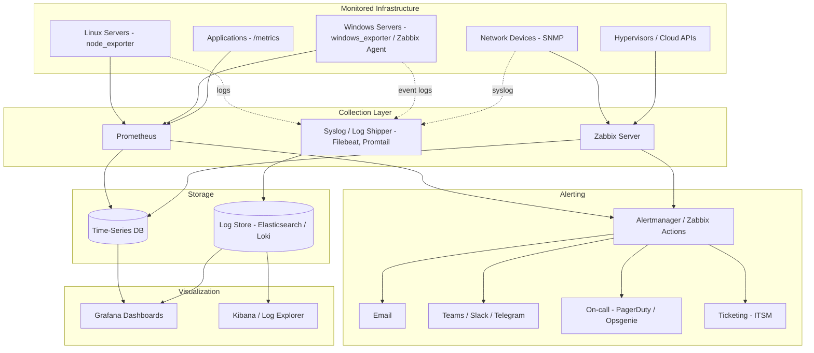

# 📊 Monitoring Architecture

Το monitoring ενός σύγχρονου περιβάλλοντος καλύπτει τρεις πυλώνες της **observability**:

| Πυλώνας | Τι δείχνει | Παραδείγματα εργαλείων |
|---------|-----------|------------------------|
| **Metrics** | Αριθμητικές μετρήσεις (CPU, RAM, bandwidth) | Prometheus, Zabbix, PRTG |
| **Logs** | Γεγονότα και μηνύματα | ELK / OpenSearch, Graylog, Loki |
| **Traces** | Διαδρομή αιτημάτων σε εφαρμογές | Jaeger, Tempo, OpenTelemetry |

## 📐 Διάγραμμα (Metrics + Logs + Alerting)

## 🔍 Τι παρακολουθούμε

| Στρώμα | Μετρικές / Ελέγχοι |
|--------|---------------------|
| **Υποδομή** | CPU, RAM, δίσκος (χώρος και IOPS), uptime, services |
| **Δίκτυο** | Bandwidth, latency, packet loss, interface errors, SNMP traps |
| **Εφαρμογές** | Response time, error rate (HTTP 5xx), ουρές, connections |
| **Ασφάλεια** | Αποτυχημένες συνδέσεις, αλλαγές σε privileged groups, firewall events |
| **Πιστοποιητικά** | Λήξη SSL/TLS |
| **Backup** | Επιτυχία jobs, ηλικία τελευταίου επιτυχούς backup |
| **AD** | Replication health, FSMO, DNS, χρόνος |

## 🚦 Επίπεδα σοβαρότητας (Severity)

| Επίπεδο | Σημασία | Ενέργεια |
|---------|---------|----------|
| **Info** | Ενημερωτικό | Καταγραφή |
| **Warning** | Πιθανό πρόβλημα (π.χ. δίσκος 80%) | Email / chat, εντός ωραρίου |
| **High** | Υποβάθμιση υπηρεσίας | Ειδοποίηση άμεσα |
| **Critical** | Εκτός λειτουργίας υπηρεσία | Paging 24/7 και ticket |

## ✅ Βέλτιστες πρακτικές

- Παρακολούθηση της **συμπεριφοράς της υπηρεσίας** (π.χ. HTTP check), όχι μόνο των πόρων.
- Σαφή **thresholds** και **alert fatigue prevention**: ειδοποίηση μόνο για ό,τι απαιτεί ενέργεια.
- **Dashboards** ανά ρόλο (NOC overview, server detail, network).
- Το monitoring **εκτός του παραγωγικού περιβάλλοντος** ώστε να λειτουργεί όταν αυτό πέσει.
- **Παρακολούθηση του monitoring** (dead man's switch / heartbeat).
- Συγχρονισμός ώρας (NTP) σε όλα τα συστήματα για σωστή συσχέτιση logs.
- **Retention policy** για metrics και logs (π.χ. 15 ημέρες raw, 1 έτος aggregated).
- Σύνδεση με **ITSM** για αυτόματη δημιουργία incidents.

## ⚠️ Συχνά λάθη

- Υπερβολικά πολλά alerts που οδηγούν σε αγνόησή τους.
- Παρακολούθηση μόνο CPU/RAM χωρίς έλεγχο της πραγματικής υπηρεσίας.
- Κανένα monitoring για backups και πιστοποιητικά.
- Logs μόνο τοπικά, οπότε χάνονται όταν ο server παραβιαστεί ή καταστραφεί.

## 🔗 Σχετικά

[Enterprise Network](./01-enterprise-network.md) · [Backup](./06-backup-architecture.md) · [Disaster Recovery](./08-disaster-recovery-architecture.md)
