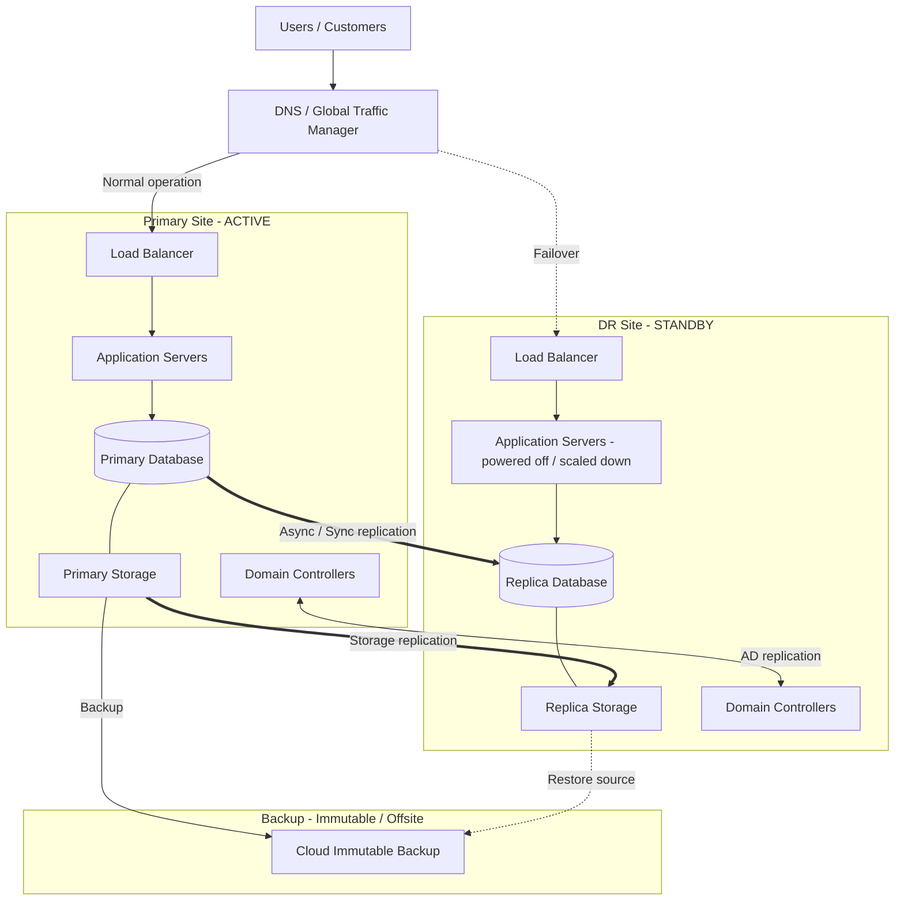
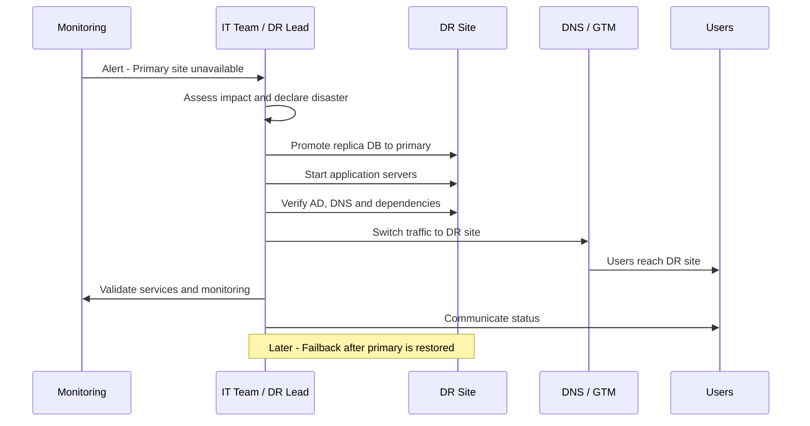

# 🆘 Disaster Recovery Architecture

Το **Disaster Recovery (DR)** είναι το σύνολο των αρχιτεκτονικών και διαδικασιών που επιτρέπουν την επαναφορά των κρίσιμων υπηρεσιών μετά από σοβαρή βλάβη (πυρκαγιά, ransomware, διακοπή ρεύματος, καταστροφή datacenter).

## 🎯 Βασικοί όροι

| Όρος | Σημασία |
|------|---------|
| **RPO** (Recovery Point Objective) | Μέγιστη αποδεκτή απώλεια δεδομένων (π.χ. 15 λεπτά) |
| **RTO** (Recovery Time Objective) | Μέγιστος αποδεκτός χρόνος αποκατάστασης (π.χ. 4 ώρες) |
| **MTD** | Maximum Tolerable Downtime: ο χρόνος μετά τον οποίο η επιχείρηση πλήττεται σοβαρά |
| **BIA** | Business Impact Analysis: ανάλυση κρισιμότητας υπηρεσιών |
| **Failover** | Μετάβαση στο DR site |
| **Failback** | Επιστροφή στο κύριο site |

## 📐 Διάγραμμα (Primary Site ↔ DR Site)

## 📐 Διαδικασία Failover

## 🧮 Στρατηγικές DR (από φθηνότερη στην ακριβότερη)

| Στρατηγική | Περιγραφή | Τυπικό RTO | Τυπικό RPO | Κόστος |
|------------|-----------|------------|------------|--------|
| **Backup & Restore** | Επαναφορά από backup σε νέο περιβάλλον | Ώρες - ημέρες | Ώρες | 💲 |
| **Pilot Light** | Ελάχιστη υποδομή (π.χ. βάσεις) διαρκώς ενεργή | Ώρες | Λεπτά | 💲💲 |
| **Warm Standby** | Μικρότερης κλίμακας πλήρες περιβάλλον σε λειτουργία | Λεπτά - ώρες | Δευτερόλεπτα - λεπτά | 💲💲💲 |
| **Hot Site / Active-Active** | Πλήρες περιβάλλον ενεργό σε δύο sites | Δευτερόλεπτα - λεπτά | Σχεδόν μηδέν | 💲💲💲💲 |

## 🏷️ Κατηγοριοποίηση συστημάτων (Tiers)

| Tier | Παράδειγμα συστημάτων | Στόχος RTO / RPO |
|------|------------------------|------------------|
| **Tier 0** | Active Directory, DNS, DHCP, Network core | < 1 ώρα / ≈ 0 |
| **Tier 1** | ERP, e-commerce, βάσεις κρίσιμων εφαρμογών | 1-4 ώρες / ≤ 15 λεπτά |
| **Tier 2** | Email, file servers | 4-24 ώρες / ≤ 4 ώρες |
| **Tier 3** | Dev/Test, εσωτερικά εργαλεία | 24-72 ώρες / 24 ώρες |

## 📋 Σειρά επαναφοράς (παράδειγμα)

1. Δίκτυο και συνδεσιμότητα (VPN, firewall)
2. Active Directory, DNS, DHCP
3. Storage και βάσεις δεδομένων
4. Εφαρμογές Tier 1
5. Email και file services
6. Υπόλοιπες υπηρεσίες
7. Επαλήθευση, monitoring και ενημέρωση χρηστών

## ✅ Βέλτιστες πρακτικές

- **Business Impact Analysis** πριν τον σχεδιασμό: δεν χρειάζεται όλα να έχουν RTO 5 λεπτών.
- Γραπτό **DR Plan και runbooks** με ρόλους, επαφές και βήματα.
- **Τακτικές δοκιμές DR** (tabletop ασκήσεις και πραγματικό failover τουλάχιστον ετησίως).
- Το DR site σε **επαρκή γεωγραφική απόσταση** από το κύριο.
- **Immutable backups** ως τελευταία γραμμή άμυνας ενάντια σε ransomware (η replication αντιγράφει και τη διαφθορά).
- Κοινός **DNS/identity** σχεδιασμός που λειτουργεί και στα δύο sites.
- Εκτός δικτύου **λίστα επαφών και credentials** (break-glass accounts) για έκτακτη ανάγκη.
- Ενημέρωση του plan μετά από κάθε σημαντική αλλαγή στην υποδομή.

## ⚠️ Συχνά λάθη

- Σχέδιο που δεν έχει δοκιμαστεί ποτέ.
- Θεωρείται ότι η replication αντικαθιστά το backup.
- Το DR site εξαρτάται από υπηρεσίες (AD, DNS, DHCP) που βρίσκονται μόνο στο κύριο site.
- Άγνωστο RTO/RPO ανά εφαρμογή.
- Έλλειψη διαδικασίας failback.

## 🔗 Σχετικά

[Backup Architecture](./06-backup-architecture.md) · [Hybrid Cloud (Azure Site Recovery)](./03-hybrid-cloud.md) · [Active Directory](./02-active-directory-topology.md)
