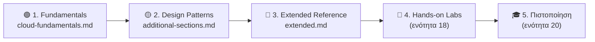
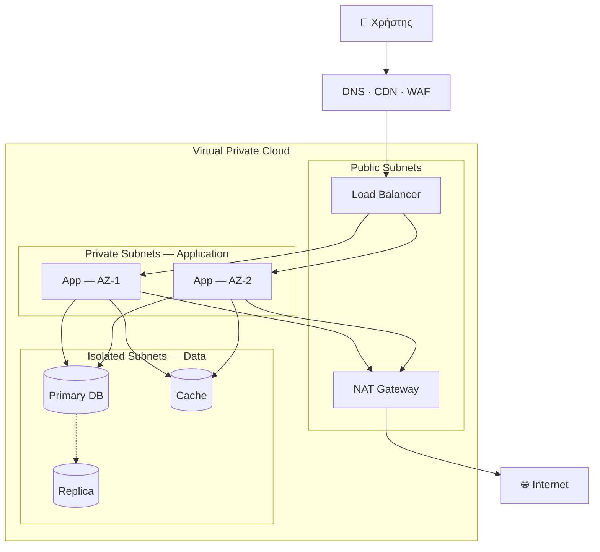

<div align="center">

# ☁️ Cloud Computing Architecture, Networking, Security & Modern Infrastructure

**Δομημένος οδηγός εκμάθησης και αναφοράς για σύγχρονες cloud υποδομές:**
**από τις βασικές έννοιες μέχρι production-grade αρχιτεκτονική, ασφάλεια και λειτουργία.**


</div>

---

## 📌 Επισκόπηση

Η ενότητα αυτή αποτελεί μέρος του [Infrastructure Knowledge Base](../README.md) και συγκεντρώνει τεχνικές σημειώσεις, διαγράμματα αρχιτεκτονικής, πίνακες απόφασης και πρακτικά παραδείγματα για το **Cloud Computing**.

Ο στόχος δεν είναι ο απλός ορισμός εννοιών, αλλά η κατανόηση του **«γιατί»** πίσω από κάθε αρχιτεκτονική επιλογή, δηλαδή των trade-offs κόστους, ασφάλειας, αξιοπιστίας και πολυπλοκότητας που αντιμετωπίζει μια ομάδα υποδομών στην πράξη.

### Τι θα βρεις εδώ

- ✅ Εννοιολογικό υπόβαθρο: service/deployment models, Shared Responsibility, Regions & AZs
- ✅ Reference architectures με διαγράμματα (Mermaid) που αποδίδονται απευθείας στο GitHub
- ✅ Δικτύωση, hybrid connectivity και Zero Trust ασφάλεια
- ✅ IAM, κρυπτογράφηση, secrets management και compliance
- ✅ IaC, CI/CD, containers, Kubernetes και serverless
- ✅ Disaster Recovery, High Availability, SRE και FinOps
- ✅ Troubleshooting playbook, hands-on labs και ερωτήσεις συνέντευξης

---

## 🗂️ Περιεχόμενα του Φακέλου

| Αρχείο | Εστίαση | Επίπεδο | Περιγραφή |
| --- | --- | :---: | --- |
| [`cloud-fundamentals.md`](./cloud-fundamentals.md) | **Βάσεις** | 🟢 | Ορισμός cloud, IaaS/PaaS/SaaS, deployment models, αντιστοίχιση on-prem ↔ cloud δικτύων, Load Balancing, CDN, VMs vs Containers, security βασικά, storage, IaC, serverless, Kubernetes, monitoring |
| [`cloud-fundamentals-additional-sections.md`](./cloud-fundamentals-additional-sections.md) | **Design Patterns** | 🟡 | 3-Tier reference architecture, προχωρημένη δικτύωση (Peering, Transit Gateway, VPN, Direct Connect), DR στρατηγικές, Zero Trust, FinOps, CI/CD & deployment strategies, Well-Architected checklist |
| [`cloud-fundamentals-extended.md`](./cloud-fundamentals-extended.md) | **Βάθος & Πράξη** | 🟡🔴 | Service mapping AWS/Azure/GCP, επιλογή compute, βάσεις δεδομένων, scalability & HA, messaging, resilience patterns, IAM σε βάθος, defense in depth, secrets, compliance, migration (6 R), Docker/K8s, Terraform, SRE, troubleshooting, labs, interview Q&A |

---

## 🧭 Προτεινόμενη Διαδρομή Μελέτης



| Βήμα | Στόχος | Χρόνος (ενδεικτικά) |
| :---: | --- | --- |
| **1** | Κατανόηση βασικών εννοιών και ορολογίας | 3–5 ώρες |
| **2** | Εξοικείωση με αρχιτεκτονικά patterns και trade-offs | 4–6 ώρες |
| **3** | Εμβάθυνση σε IAM, δεδομένα, messaging, Kubernetes, SRE | 8–12 ώρες |
| **4** | Εφαρμογή με πραγματικά labs και τεκμηρίωση | 15+ ώρες |
| **5** | Επικύρωση γνώσεων μέσω πιστοποίησης | Ανάλογα με τον στόχο |

---

## 🧩 Χάρτης Θεματολογίας

| Θεματική Ενότητα | Fundamentals | Design Patterns | Extended |
| --- | :---: | :---: | :---: |
| Service & Deployment Models | ✅ | | |
| Shared Responsibility Model | ✅ | | ✅ |
| Regions, AZs, Edge | | | ✅ |
| Δικτύωση (VPC, Subnets, SG/NACL) | ✅ | ✅ | ✅ |
| Hybrid Connectivity (VPN, Direct Connect, TGW) | | ✅ | |
| Load Balancing & CDN | ✅ | ✅ | |
| Compute: VMs, Containers, Serverless | ✅ | | ✅ |
| Βάσεις Δεδομένων & Caching | | ✅ | ✅ |
| Messaging & Event-Driven | | | ✅ |
| Scalability & High Availability | | ✅ | ✅ |
| Disaster Recovery | | ✅ | |
| IAM & Access Control | ✅ | ✅ | ✅ |
| Zero Trust & Defense in Depth | | ✅ | ✅ |
| Encryption & Secrets Management | ✅ | | ✅ |
| Compliance & Governance | | | ✅ |
| Infrastructure as Code | ✅ | ✅ | ✅ |
| CI/CD & Deployment Strategies | | ✅ | |
| Kubernetes & Containers | ✅ | | ✅ |
| Monitoring & Observability | ✅ | | ✅ |
| FinOps & Cost Optimization | | ✅ | |
| Cloud Migration | | | ✅ |
| SRE (SLI/SLO, Incident Mgmt) | | | ✅ |
| Troubleshooting | | | ✅ |

---

## 🏗️ Αρχιτεκτονική Αναφοράς (Σύνοψη)



Αναλυτική περιγραφή και αιτιολόγηση κάθε στοιχείου: [`cloud-fundamentals-additional-sections.md`](./cloud-fundamentals-additional-sections.md#️-1-reference-architecture-3-tier-web-application).

---

## 🎯 Σε ποιους απευθύνεται

- **Υποψήφιοι Cloud / DevOps / Infrastructure Engineers** που χτίζουν στέρεο θεωρητικό και πρακτικό υπόβαθρο
- **System & Network Administrators** που μεταβαίνουν από on-premises σε cloud περιβάλλοντα
- **Φοιτητές και αυτοδίδακτοι** που προετοιμάζονται για πιστοποιήσεις (AWS, Azure, GCP, CKA, Terraform)
- **Developers** που θέλουν να κατανοήσουν την υποδομή στην οποία τρέχουν οι εφαρμογές τους

---

## 📐 Συμβάσεις Τεκμηρίωσης

| Σύμβολο | Σημασία |
| :---: | --- |
| 🟢 / 🟡 / 🔴 | Επίπεδο δυσκολίας: Beginner / Intermediate / Advanced |
| 💲 … 💲💲💲💲 | Σχετικό κόστος μιας λύσης |
| `> blockquote` | Βέλτιστες πρακτικές, προειδοποιήσεις και βασικά συμπεράσματα |
| ```` ```mermaid ```` | Διάγραμμα που αποδίδεται αυτόματα στο GitHub |
| `<details>` | Συμπτυσσόμενες απαντήσεις (π.χ. ερωτήσεις συνέντευξης) |

**Σημείωση:** Τα ονόματα υπηρεσιών, οι τιμές και τα όρια των cloud providers αλλάζουν συχνά. Για αποφάσεις παραγωγής, επιβεβαίωσε πάντα στην **επίσημη τεκμηρίωση** του παρόχου. Τα παραδείγματα κώδικα προορίζονται για εκπαιδευτική χρήση και πρέπει να προσαρμόζονται (ονόματα πόρων, ARNs, regions) πριν από οποιαδήποτε εφαρμογή.

---

## 🛠️ Τεχνολογίες που Καλύπτονται

| Κατηγορία | Τεχνολογίες |
| --- | --- |
| **Cloud Providers** | AWS · Microsoft Azure · Google Cloud Platform |
| **IaC & Automation** | Terraform · CloudFormation · Bicep · Ansible |
| **Containers & Orchestration** | Docker · Kubernetes (EKS / AKS / GKE) |
| **CI/CD** | GitHub Actions · GitLab CI · Jenkins · Argo CD (GitOps) |
| **Observability** | Prometheus · Grafana · CloudWatch · Azure Monitor |
| **Security** | IAM · KMS · Secrets Manager / Key Vault · WAF · Checkov / tfsec / Trivy |
| **Data & Messaging** | RDS · DynamoDB · Redis · SQS / SNS · Kafka |

---

## 🗓️ Roadmap

- [x] Cloud fundamentals (service & deployment models, networking, storage)
- [x] Reference architectures & design patterns
- [x] Extended reference (IAM, data, messaging, migration, SRE)
- [ ] Πλήρη Terraform labs με κώδικα στον φάκελο `labs/`
- [ ] Παράδειγμα CI/CD pipeline (GitHub Actions) με deploy σε Kubernetes
- [ ] Cheat sheets: `kubectl`, `terraform`, `aws cli`, `az cli`
- [ ] Ενότητα Cloud Security Posture (CSPM) και incident response runbooks
- [ ] Cost-optimization case studies με πραγματικά νούμερα
- [ ] Αγγλική έκδοση βασικών εγγράφων

---

## 🤝 Συνεισφορά & Διόρθωση

Αν εντοπίσεις τεχνική ανακρίβεια, παλιά πληροφορία ή έχεις πρόταση βελτίωσης:

1. Άνοιξε ένα [Issue](https://github.com/Dimitriskatsanos42/Infrastructure-Knowledge-Base/issues) με σαφή περιγραφή και, αν γίνεται, πηγή.
2. Ή δημιούργησε ένα **Pull Request** με την προτεινόμενη αλλαγή.

---

## 🔗 Πλοήγηση

- ⬆️ [Infrastructure Knowledge Base — Αρχική](../README.md)
- 📘 [Cloud Fundamentals](./cloud-fundamentals.md)
- 📗 [Additional Sections: Design Patterns](./cloud-fundamentals-additional-sections.md)
- 📕 [Extended Reference](./cloud-fundamentals-extended.md)

---

<div align="center">

**Living documentation** · Το περιεχόμενο εξελίσσεται μαζί με τη μαθησιακή διαδρομή και την τεχνολογία.

Maintained by [@Dimitriskatsanos42](https://github.com/Dimitriskatsanos42)

</div>
