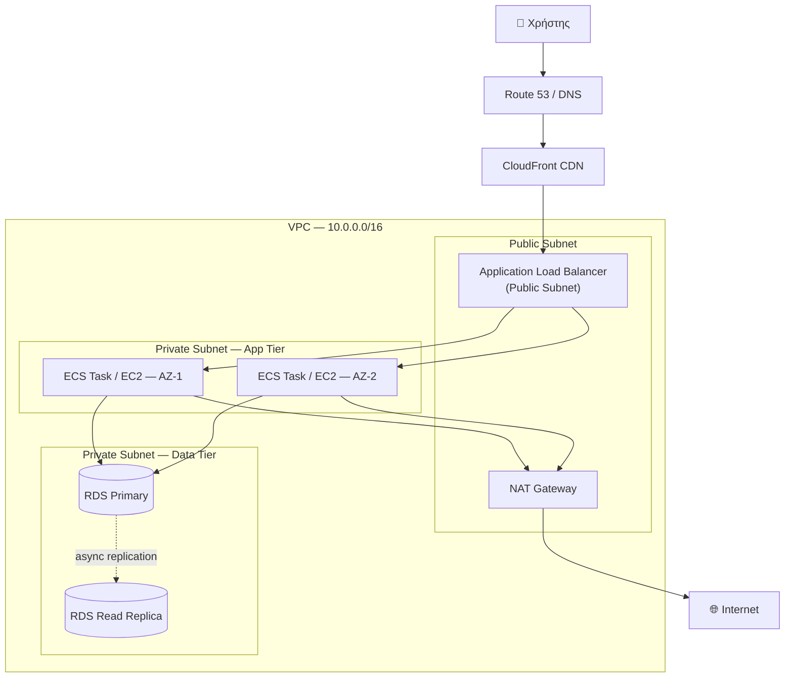
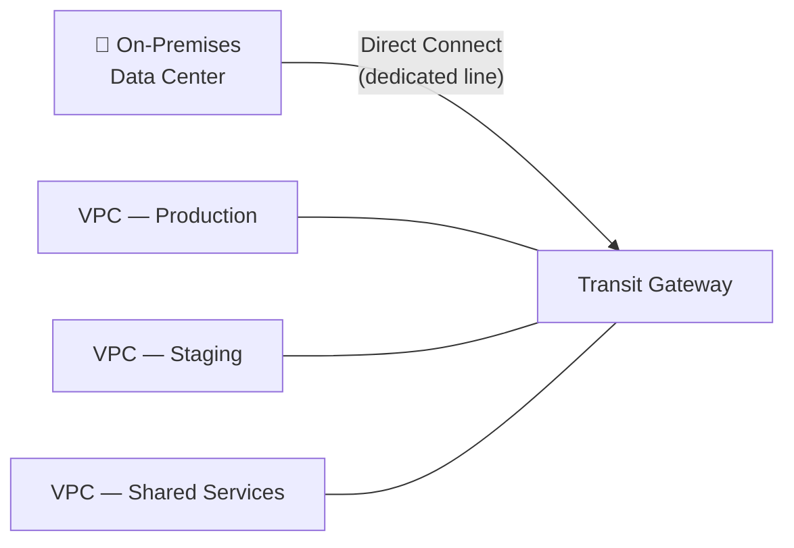
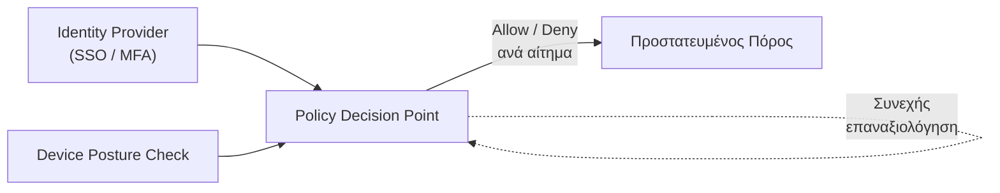
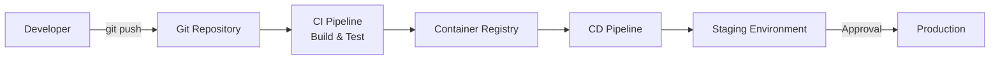

# ☁️ Cloud Architecture: Advanced Topics & Real-World Design Patterns

> **Μέρος του [Infrastructure Knowledge Base](../README.md)** — συνέχεια του [`cloud-fundamentals.md`](./cloud-fundamentals.md).
> Εστιάζει σε αρχιτεκτονικά design patterns, διαγράμματα υποδομής και αποφάσεις (trade-offs) που συναντώνται σε πραγματικά production περιβάλλοντα, πέρα από τη θεωρία.

---

## 🗺️ Περιεχόμενα

1. [Reference Architecture: 3-Tier Web Application](#-1-reference-architecture-3-tier-web-application)
2. [Προχωρημένη Δικτύωση](#-2-προχωρημένη-δικτύωση)
3. [Disaster Recovery & Business Continuity](#-3-disaster-recovery--business-continuity)
4. [Zero Trust Security Architecture](#-4-zero-trust-security-architecture)
5. [Cost Optimization & FinOps](#-5-cost-optimization--finops)
6. [CI/CD & Deployment Strategies](#-6-cicd--deployment-strategies)
7. [Well-Architected Framework Checklist](#-7-well-architected-framework-checklist)
8. [Γλωσσάρι Όρων](#-8-γλωσσάρι-όρων)

---

## 🏗️ 1. Reference Architecture: 3-Tier Web Application

Το πιο διαδεδομένο production pattern για web εφαρμογές είναι ο διαχωρισμός σε τρία επίπεδα — **Presentation**, **Application** και **Data** — καθένα σε ξεχωριστό subnet με διαφορετικό επίπεδο έκθεσης στο Internet. Ο στόχος είναι απλός: **κανένα κρίσιμο component δεν εκτίθεται άμεσα στο κοινό δίκτυο**.



### Αρχές σχεδίασης

| Στοιχείο | Ρόλος | Γιατί έτσι |
|---|---|---|
| **Application Load Balancer** | Μοναδικό public-facing entry point | Κεντρικοποιεί το TLS termination και το health-checking, αποκρύπτοντας τα backend instances |
| **App Tier (private subnet)** | Εκτελεί επιχειρησιακή λογική | Χωρίς δημόσια IP — προσβάσιμο μόνο μέσω του ALB |
| **NAT Gateway** | Εξερχόμενη πρόσβαση για private instances | Επιτρέπει outbound κίνηση (π.χ. patches, API calls) χωρίς να δέχεται inbound συνδέσεις |
| **Data Tier (isolated subnet)** | Αποθήκευση δεδομένων | Security Group που δέχεται κίνηση **αποκλειστικά** από το SG του App Tier — ποτέ από CIDR range |
| **Read Replica** | Ανακούφιση read-heavy φόρτου | Αποσυμφορεί τον Primary, βελτιώνει latency για reporting/analytics queries |

> **Καλή πρακτική:** Τα Security Groups πρέπει να αναφέρονται μεταξύ τους (`source: sg-xxxxx`) και όχι σε IP ranges. Έτσι το privilege παραμένει σωστό ακόμα κι αν αλλάξουν οι IPs των instances κατά το scaling.

---

## 🔗 2. Προχωρημένη Δικτύωση

Καθώς μια αρχιτεκτονική μεγαλώνει πέρα από ένα μοναδικό VPC, προκύπτει η ανάγκη σύνδεσης πολλαπλών δικτύων — μεταξύ VPCs, ή μεταξύ cloud και on-premises υποδομής.

| Λύση | Τοπολογία | Ιδανικό για | Περιορισμός |
|---|---|---|---|
| **VPC Peering** | 1-προς-1 | Λίγα, στατικά VPCs | Δεν υποστηρίζει transitive routing |
| **Transit Gateway** | Hub-and-spoke | Δεκάδες VPCs / hybrid connectivity | Επιπλέον κόστος ανά σύνδεση |
| **Site-to-Site VPN** | Encrypted tunnel μέσω Internet | Γρήγορη υλοποίηση hybrid σύνδεσης | Latency εξαρτώμενο από το δημόσιο Internet |
| **Direct Connect / ExpressRoute** | Αποκλειστική φυσική γραμμή | Enterprise, high-throughput, χαμηλό & σταθερό latency | Υψηλότερο κόστος, χρόνος εγκατάστασης |



> **Γιατί Transit Gateway αντί για full-mesh Peering;**
> Με *N* VPCs, το full-mesh Peering απαιτεί *N×(N-1)/2* συνδέσεις — πρακτικά μη διαχειρίσιμο πάνω από 4-5 VPCs. Το Transit Gateway μετατρέπει το πρόβλημα σε *N* απλές συνδέσεις προς έναν κεντρικό κόμβο δρομολόγησης, με ενιαίο σημείο ελέγχου για routing policies.

---

## 🛡️ 3. Disaster Recovery & Business Continuity

Κάθε στρατηγική DR ορίζεται από δύο μετρικές που πρέπει να συμφωνούνται **πριν** τον σχεδιασμό, όχι μετά από ένα incident:

- **RTO (Recovery Time Objective):** μέγιστος αποδεκτός χρόνος μέχρι το σύστημα να ξαναλειτουργήσει.
- **RPO (Recovery Point Objective):** μέγιστη αποδεκτή απώλεια δεδομένων, εκφρασμένη σε χρόνο.

| Στρατηγική | Τυπικό RTO | Τυπικό RPO | Σχετικό Κόστος | Περιγραφή |
|---|---|---|---|---|
| **Backup & Restore** | Ώρες | Ώρες | 💲 | Περιοδικά backups σε δεύτερη region· ανάκτηση κατ' απαίτηση |
| **Pilot Light** | Λεπτά–Ώρες | Λεπτά | 💲💲 | Ελάχιστη "σβηστή" υποδομή έτοιμη να κλιμακωθεί |
| **Warm Standby** | Λεπτά | Δευτερόλεπτα | 💲💲💲 | Μειωμένης κλίμακας, πλήρως λειτουργικό αντίγραφο, πάντα ενεργό |
| **Multi-Site Active-Active** | Σχεδόν μηδενικό | Σχεδόν μηδενικό | 💲💲💲💲 | Ταυτόχρονη λειτουργία σε πολλαπλές regions με real-time replication |

> Η επιλογή στρατηγικής είναι πάντα **trade-off κόστους έναντι ανοχής σε διακοπή**. Δεν υπάρχει "σωστή" απάντηση χωρίς σαφές SLA και κατηγοριοποίηση της κρισιμότητας του συστήματος (π.χ. tier-1 vs tier-3 εφαρμογή).

---

## 🔐 4. Zero Trust Security Architecture

> *"Never trust, always verify."* Καμία οντότητα — χρήστης, συσκευή ή υπηρεσία — δεν θεωρείται έμπιστη εξ ορισμού, ανεξάρτητα από τη θέση της στο δίκτυο.



### Πυλώνες υλοποίησης

- **Least Privilege Access:** δικαιώματα μόνο τα απολύτως απαραίτητα, χρονικά περιορισμένα όπου γίνεται (just-in-time access, όχι μόνιμα admin rights).
- **Micro-Segmentation:** το δίκτυο χωρίζεται σε μικρές, απομονωμένες ζώνες — μια παραβίαση σε ένα σημείο δεν επιτρέπει ελεύθερη κίνηση (lateral movement) στο υπόλοιπο σύστημα.
- **Continuous Verification:** η ταυτότητα και τα δικαιώματα ελέγχονται σε **κάθε** αίτημα, όχι μόνο κατά το αρχικό login.
- **Identity as the Perimeter:** η ταυτότητα (όχι η φυσική/δικτυακή θέση) γίνεται το κεντρικό σημείο ελέγχου ασφαλείας.

---

## 💰 5. Cost Optimization & FinOps

Το **FinOps** είναι η πρακτική συνεργασίας engineering, finance και διοίκησης, ώστε το κόστος cloud να είναι προβλέψιμο και δικαιολογημένο.

| Πρακτική | Πώς λειτουργεί | Τυπικό αποτέλεσμα |
|---|---|---|
| **Right-Sizing** | Επιλογή instance type βάσει πραγματικής χρήσης CPU/RAM | Αποφυγή over-provisioning |
| **Reserved Instances / Savings Plans** | Δέσμευση χρήσης 1-3 ετών | Έκπτωση έως ~70% έναντι on-demand |
| **Spot Instances** | Αξιοποίηση αχρησιμοποίητης χωρητικότητας | Μεγάλη έκπτωση, με ρίσκο διακοπής — ιδανικό για fault-tolerant/batch workloads |
| **Storage Lifecycle Policies** | Αυτόματη μετάβαση παλιών δεδομένων σε φθηνότερη κλάση | π.χ. S3 Standard → S3 Glacier |
| **Tagging Strategy** | Ετικέτες `team`/`environment`/`project` σε κάθε πόρο | Ακριβής κατανομή κόστους (cost allocation) ανά ομάδα |

---

## 🔁 6. CI/CD & Deployment Strategies



| Στρατηγική | Πώς λειτουργεί | Ρίσκο / Όφελος |
|---|---|---|
| **Blue-Green** | Δύο πανομοιότυπα περιβάλλοντα· η κίνηση μεταφέρεται ακαριαία στο νέο | Χαμηλό ρίσκο — άμεσο rollback αν χρειαστεί |
| **Canary** | Σταδιακή διοχέτευση κίνησης (π.χ. 5% → 50% → 100%) | Έγκαιρη ανίχνευση προβλημάτων πριν επηρεαστούν όλοι οι χρήστες |
| **Rolling Update** | Σταδιακή αντικατάσταση instances ένα-ένα | Μεσαίο ρίσκο — προσωρινά συνυπάρχουν δύο εκδόσεις |

**Παράδειγμα Infrastructure as Code (Terraform):**

```hcl
resource "aws_instance" "web_server" {
  ami           = "ami-0abcdef1234567890"
  instance_type = "t3.micro"
  subnet_id     = aws_subnet.private_app.id

  tags = {
    Name        = "web-server"
    Environment = "production"
  }
}
```

---

## 🏛️ 7. Well-Architected Framework Checklist

Ένα σύνολο βέλτιστων πρακτικών (AWS, Azure και GCP έχουν αντίστοιχα frameworks), οργανωμένο σε πυλώνες — χρήσιμο ως λίστα ελέγχου πριν από κάθε production launch.

| Πυλώνας | Βασική Ερώτηση |
|---|---|
| **Operational Excellence** | Μπορώ να παρακολουθώ και να λειτουργώ το σύστημα με αξιοπιστία; |
| **Security** | Ποιος έχει πρόσβαση σε τι, και είναι κρυπτογραφημένα τα δεδομένα in transit & at rest; |
| **Reliability** | Τι συμβαίνει αν χαθεί μια Availability Zone; Μια ολόκληρη Region; |
| **Performance Efficiency** | Χρησιμοποιώ τους κατάλληλους πόρους για το συγκεκριμένο workload; |
| **Cost Optimization** | Πληρώνω για χωρητικότητα που δεν χρησιμοποιείται; |
| **Sustainability** | Ελαχιστοποιώ το περιβαλλοντικό αποτύπωμα της υποδομής μου; |

---

## 📖 8. Γλωσσάρι Όρων

| Όρος | Ορισμός |
|---|---|
| **RTO** | Recovery Time Objective — μέγιστος αποδεκτός χρόνος διακοπής λειτουργίας |
| **RPO** | Recovery Point Objective — μέγιστη αποδεκτή απώλεια δεδομένων σε χρόνο |
| **SLA** | Service Level Agreement — συμβατική δέσμευση διαθεσιμότητας/απόδοσης |
| **CIDR** | Classless Inter-Domain Routing — τρόπος ορισμού εύρους IP διευθύνσεων |
| **IAM** | Identity and Access Management |
| **AZ** | Availability Zone — ανεξάρτητο data center μέσα σε μια Region |
| **IaC** | Infrastructure as Code |
| **GitOps** | Διαχείριση υποδομής/deployments με το Git ως single source of truth |

---

*Αυτό το αρχείο συνεχίζει τη δομή του [`cloud-fundamentals.md`](./cloud-fundamentals.md) και προτείνεται να τοποθετηθεί στον ίδιο φάκελο `Cloud Computing Architecture, Networking, Security and Modern Infrastructure/`.*
